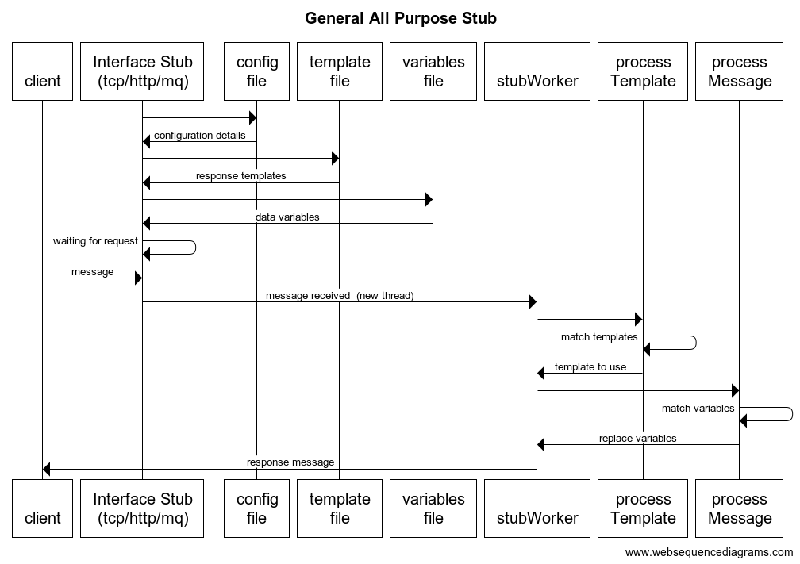

## General All Purpose Stub (GAPS)

In performance testing the requirement for interfacing systems can sometimes cause delays in execution or inconsistent results due to Interfacing Systems:
1.	environment size, if not the same capacity as the System under test (SUT)
2.	environment availability, if it is being used by another testing project
3.	data alignment with SUT
4.	data size may not be production like in size or 

The General All Purpose Stub (GAPS) is a generic stubbing platform used to emulate downstream systems for performance testing.




## Designing your test stub

The aim of the Stub is to allow you to isolate the system you want to test, so that it is the only system in play. This will prevent external systems from affecting your results. It also means you are not dependent on the presence of that system to complete your test. With this in mind, the design centres on illustrating the flows in and out of the system of concern to complete a transaction.

## Determine the transactions

Transactions can generally be identified from detailed test specifications or use case documents. They represent a flow through your system that serves a particular purpose. The first step in completing your design is to identify the list of transactions that you want to use in your test. With each transaction you have identified, you need to do the following. Some transactions will be simple in that involve only a test driver, others will be complex and will require not only a driver, but one or more request response pairs with external systems represented in order to complete the transaction.

## Determine the Driver

The first important aspect of designing your test is to determine what drives the transaction. By this, we mean what triggers off the transaction in your source system. This can be an interface from an external system or driven from a user interface.

## Request and Response Pairs

Once the driving source is identified, you trace the transaction through your system and seek to identify the series of request and response pairs involving your system and one or more external systems to complete the transaction. 

## Interface Configuration

Once you have represented the flows for each transaction, you will need to capture the configuration information relevant to the protocol you are using. The required information for each protocol is addressed in the relevant sections of this document.

## GAPS Structure

We are reliant on developing valid json files. The easiest way to do this is to use an json editor that will validate as you prepare the configuration file. This schema file contains the basic validations that need to be met in order to prepare a valid configuration for running the stub.

The following json files are required.
•	“config.json” details of interface type, ports, redis servers, sockets threads, etc.
•	“requestresponse.json” contain the base template content you want to use in your response messages.
•	“datavariables.json” the variables you want to generate for replacements in the response message.

## Configuration

Core properties include the following attributes to describe the content of the configuration file:

There can be only one interface type per config. Following example list details for all interface types.

```
{
	"config": [
		{
			"name" : "core",
			"details" : [{
                "stubName": "MQ Stub",
                "threadPool": "100"
    		}]
		},
    {
			"name" : "rabbitmq",
			"details" : [{
                "mqHostName" : "localhost",
                "mqHostPort" : "5672",
                "mqInQueue" : "testQueue",
                "mqOutQueue" : "outQueue"    		
        }]
		},
        {
			"name" : "http",
			"details" : [{
                "mqHostName" : "localhost",
                "mqHostPort" : "5672",
                "mqInQueue" : "testQueue",
                "mqOutQueue" : "outQueue"    		
        }]
		}
    {
			"name" : "redis",
			"details" : [{
                "redisHostName" : "localhost",
                "redisHostPort" : "6379"
        }]
		}
  ]
} 
```

| Attribute | Attribute | Required | type | Description |
| :---: | :---: | :---: | :---: | --- |
| config|  | Yes | string | controlling json element |
||
| name  | |Yes | string | name of the current config element, either core, rabbitmq, http, tcp, redis  | 
| details  || Yes | string | details of the current config element |
|**name**|**details**
|core       | stubName  | Yes | string | The name of the virtual service |
|       | threadPool  | Yes | string | The number of threads for the virtual service |
|**name**|**details**
|       | mqHostName  | Yes | string | The hostname or IP of the mq server |
|       | mqHostPort  | Yes | string | The hostport of the mq server |
|       | mqInQueue  | Yes | string | The name of the INBOUND (request) MQ queue |
|       | mqOutQueue  | Yes | string | The name of the OUTBOUND (response) MQ queue |
|**name**|**details**
| http  | httpHostName  | Yes | string | The hostname of the http/s server |
|       | httpHostPort  | Yes | string | The hostport of the http/s server |
|       | sslKeyName  | Yes (for https) | string | The location of the secure key. If this is set virtual service assumes **https** |
|       | sslKeyPassword  | Yes (for https) | string | The password of the secure key |
|**name**|**details**
| tcp  | tcpHostName  | Yes | string | The hostname of the tcp server |
|       | tcpHostPort  | Yes | string | The hostport of the tcp server |
|**name**|**details**
| redis      | redisHostName  | No | string | The hostname of the redis server |
|       | redisHostPort  | No | string | The hostport of the redis server |

## Request/Response templates. requestresponse.json

Request and response templates serve two purposes.

1. Identifies, based on inbound message, which response template to use
2. contains the response template with replaceable data variables (See data variables section) 

**Note** Data variables are prefixed with a %, have a name identifier and suffixed with a %. e.g. %sessionId%
Name indentifiers are generated based on data variables (See data variables section)  
```
{
	"response": [
	{
        "name": "00-status",
		"type": "body",
		"lookupWith": "regex",
		"lookupValue": "status",
        "pause": "100",
		"contents": "{\"response\": [{\"status\": \"OK\",\"message\": \"TNS Account Service/CAM Stub - status OK\",\"version\": \"%stubName%\",\"timestamp\": \"%todaysDate%\",\"GUID\": \"%GUID%\",\"Number\": \"%tokenNumber%\",\"AlphaNumer\": \"%sessionId%\"}]}"
	},
	{
        "name": "01-create-session",
		"type": "body",
		"lookupWith": "regex",
		"lookupValue": "merchant/TESTKENOCOM01/order/(.+?)/transaction",
        "pause": "100",
		"contents": "{\"result\": \"SUCCESS\",\"session\": {\"aes256Key\": \"PzUx0tR45OSdyQXzP4Y3es4lpp69KpsmLUYNC\/Qfk80=\",\"updateStatus\": \"NO_UPDATE\",\"authenticationLimit\": 5,\"id\": \"SESSION%sessionId%\",\"version\": \"872ec53701\"},\"merchant\": \"TESTKENOCOM01\"}"
	}
	]
}
```

| Attribute | Attribute | Required | type | valid values |Description |
| :---: | :---: | :---: | :---: | :---: | --- |
| response |  | Yes | string |  | controlling json array
||
| type |  | Yes | string | path or body | the area in which to serach for a match, MQ and TCP can only match body
| lookupWith |  | Yes | string | regex or string | the way to search for a match in the type area
| lookupValue |  | Yes | string | regex format or search string | the value to search for a match in the type area
| pause |  | Yes | string | number format in ms | the time to delay before sending a response
| contents |  | Yes | string |  | the response message with data variables


## data variables. datavariables.json

This file contains the replacebale data variables that are inserted into the response messsage

```{
	"__comment1__": "any variables (e.g. redis lookups) which reference other variables must be set at the BOTTOM of the file.",
	"variable": [
		{
			"name" : "tokenNumber",
			"type" : "number",
			"allowBypass": "true",
			"format" : [{
					"length" : 16					
				}]
		},
		{
			"name" : "stubName",
			"type" : "string",
			"allowBypass": "true",
			"format" : [{
					"value" : "mqStub version 1.0"					
				}]
		},
		{
			"name" : "todaysDate",
			"type" : "date",
			"allowBypass": "false",
			"format" : [
				{
					"value" : "yyyy-MM-dd HH:mm:ss"					
				}
			]
		},
		{
			"name" : "GUID",
			"type" : "guid",
			"allowBypass": "false"			
		},
		{
			"name" : "sessionId",
			"type" : "aplhanumeric",
			"allowBypass": "true",
			"format" : [{
					"length" : 24,
					"case": "upper"
				}]
		}
	]
}
```

| Attribute | Attribute | Required | type | valid values |Description |
| :---: | :---: | :---: | :---: | :---: | --- |
| variable |  | Yes | string |  | controlling json array
||
| name |  | Yes | string | alphanumeric string | the name fo the data varible
| type |  | Yes | string | string, number, date, guid, alphanumeric, substring, regex, redisRead, redisUpdate, concatenate | the type of the variable
| allowBypass |  | Yes | string | true or fales | if true always generates a variable even if not required for response replacement
| format |  | Yes | string |  | the format details of the data variable type
||
|**type**|**format**
| string |value  | Yes | string |  | the string value
|**type**|**format**
| number |length  | Yes | int |  | the length of the number
|**type**|**format**
| date |value  | Yes | simple date format |  | the format of the date
|**type**|**format**
| guid |N/A  |  |  |  | 
|**type**|**format**
| aplhanumeric |length  | Yes | int |  | the length of the string
|  |case  | Yes | the case of the string | upper, lower, mixed | teh case of the string
|**type**|**format**
| regex |value  | Yes | regex format |  | the reges format data is extracted from inbound message
|**type**|**format**
| substring |startPos  | Yes | the starting position | int | the starting position of data is extracted from inbound message
|  |endPos  | Yes | String | end pistion as an int or EOL for end of line | the starting position of data is extracted from inbound message
|**type**|**format**
| concatenate |variableName  | Yes | string |  | two or more data variables (set previously) to join together.
|**type**|**format**
| redisRead |redisSetName  | Yes | string |  | the name of the redis set to read from
|  |redisKeyName  | Yes | String |  | the name of the redis key to read from, this is a data variable set previously
|**type**|**format** 
| redisUpdate |redisSetName  | Yes | string |  | the name of the redis set to write to
|  |redisKeyName  | Yes | String |  | the name of the redis key to write to, this is a data variable set previously
|  |redisKeyValue  | Yes | String |  | the name of the redis data to write to, this is a data variable set previously


## Runtime.

### Linux (adjust as you will for windows and various versions of java)

HOMELOC=/\Users/\tim/\Documents/\gaps

CLASSPATH=.:$HOMELOC/\gaps.jar:$HOMELOC/\lib/\slf4j.api-1.6.1.jar:$HOMELOC/\lib/\slf4j-simple-1.6.1.jar:$HOMELOC/\lib/\json-smart-2.4.8.jar$:$HOMELOC/\lib/\jedis-2.8.1.jar$:$HOMELOC/\lib/\javax.json-1.0.jar$:$HOMELOC/\lib/\commons-pool2-2.6.2.jar$:$HOMELOC/\lib/\commons-lang3-3.12.0.jar$:$HOMELOC/\lib/\asm-1.0.2.jar$:$HOMELOC/\lib/\amqp-client-5.14.2.jar

java -cp $CLASSPATH -Xmx512m com.mq.mqStub
java -cp $CLASSPATH -Xmx512m com.http.httpStub
java -cp $CLASSPATH -Xmx512m com.tcp.tcpStub

## Docker

GAPS can (and probably should) be run as a docker container.

The config files described above are indepenent of GAPS itself and can be loaded into the Docker instance using the --volume command.
e.g. If the path to your config directory is /tmp/gaps_stub/config then you would enter /tmp/gaps_stub 
```
--volume=/tmp/gaps_stub/:/tmp/gaps
```

### Dockerfile for httpStub
```
FROM openjdk:19-jdk-alpine

RUN mkdir -p /tmp/gaps/config

COPY ./lib/* /tmp/gaps/lib/
RUN cd /tmp/gaps
WORKDIR /tmp/gaps

EXPOSE 2525
ENTRYPOINT ["java","--enable-preview","-cp","/tmp/gaps/lib/gaps.jar:/tmp/gaps/lib/amqp-client-5.14.2.jar:/tmp/gaps/lib/commons-lang3-3.12.0.jar:/tmp/gaps/lib/javax.json-1.0.jar:/tmp/gaps/lib/json-smart-2.4.8.jar:/tmp/gaps/lib/slf4j.api-1.6.1.jar:/tmp/gaps/lib/asm-1.0.2.jar:/tmp/gaps/lib/commons-pool2-2.6.2.jar:/tmp/gaps/lib/jedis-2.8.1.jar:/tmp/gaps/lib/slf4j-simple-1.6.1.jar","-Xmx512m","com.http.httpStub"]
```

### Docker Build
```
docker build -t image_gaps_auth0 .
```
### Docker Run

```
docker run -p 2525:2525 --volume=/Users/tim/_git/gaps/:/tmp/gaps --runtime=runc -d image_gaps_auth0 --name perf_gaps_auth0_2525
```

To test whether the image is working correctly.

```
docker run -i -t perf_gaps_auth0_2525 /bin/sh  
```
